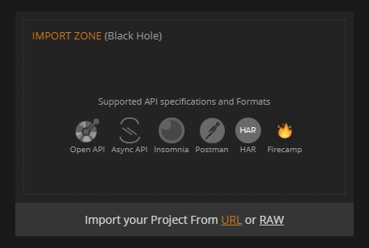
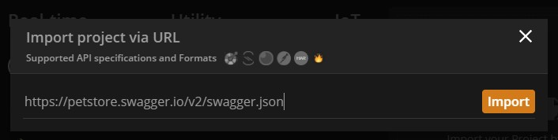
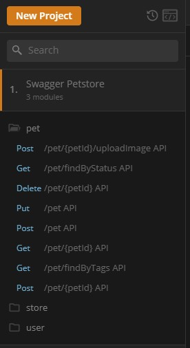
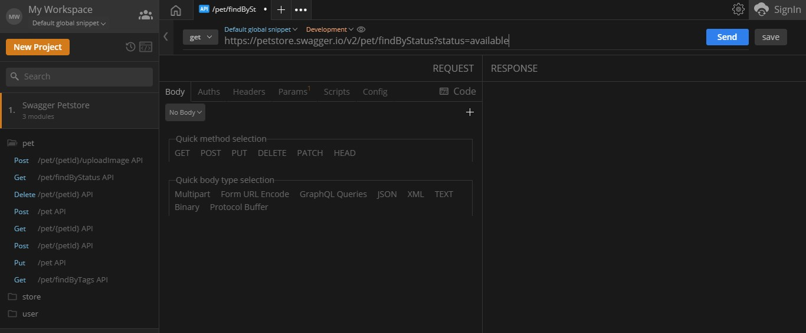
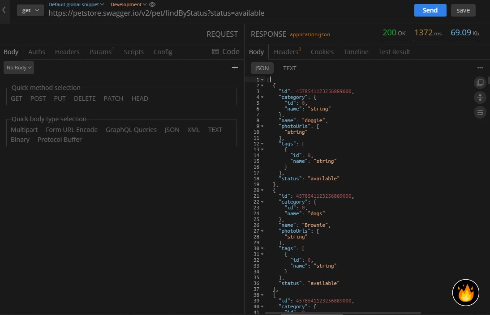

<!-- INTRO  -->
We, as developers, testers or QA engineers need a tool from which we can do all things about APIs. Whether it's about developing one or testing the same, APIs are crucial for a software product's sustenance. It's a vital tool for all businesses in industries. They allow the capabilities of one software to be used by another and work as a bridge to communicate. We use all types of APIs around the product like internal ones which are designed to be used only by the company or an open APIs where there are no restrictions to access these types of APIs because they are publicly available.

Let's talk about one of the most common and widely used API formats available; the OpenAPI specification.

## What is the OpenAPI Specification (OAS)?

> The [OpenAPI Specification (OAS)](https://www.openapis.org/) defines a standard, programming language-agnostic interface description for REST APIs, which allows both humans and computers to discover and understand the capabilities of a service without requiring access to source code, additional documentation, or inspection of network traffic.

This helps a consumer to understand and interact with a remote service with using a much less effort in logic building. 

As of writing this, the OAS is at version `3.0.3` and all of its source code is available on [GitHub](github.com/OAI/OpenAPI-Specification/).

**[Firecamp](https://firecamp.io/), a software tool which is made to build and execute APIs** from HTTPS to Web Socket to GraphQL, is highly capable of working with OAS. Here's a guided tutorial on how you can do the same.

---
<!-- BODY  -->
### Step 1: Download and Install Firecamp

<!-- Fire camp screenshot -->

  

Visit the [official Firecamp website](https://firecamp.io/) and install the software. It's a simple installation which can take a few minutes to finish. When you see this screen, this means the installation was successful.

### Step 2: The  _Black Hole_ in the  Firecamp GUI

The tool has a clear interface and provides almost all the features you need to work with APIs. To the left, you have your workspace and projects, and on the right all if the different types of services we can use.

<!-- Black hole image -->

  

One interesting feature you'll see is the **Import Zone** or the _Black Hole_ from where you can import various specifications. Let's import a sample [Swagger Petstore example](https://petstore.swagger.io/#/).  As you can see we have the following URL to import: 

`https://petstore.swagger.io/v2/swagger.json`

We hover over the _Black Hole_ and click on 'Import project from **URL**'. Make sure whatever sample you're using matches the OAS else you'll see an error and the import will not happen.

<!-- Image importing the URL -->

  

### Step 3: Get to know about the folder structure

<!-- Folder image -->

  
 

What we have here is all the modules available in the _Swagger Petstore_  API sample. These are `pet`, `store` and `user`. As per its documentation, we can get back the availability of _pets_ by checking out their _status_. This is done when we fire the `pet/findByStatus` API available under the _pet_ folder as a _GET_ request. 

### Step 4: _GET_ back the request

<!-- Before sending request image -->

  

Click on the  `pet/findByStatus` API, Firecamp automatically fills the entire API URL except for the end param. This can be `available`, `pending` or `sold` [as stated](https://petstore.swagger.io/#/pet/findPetsByStatus). Let's append the `available` paramo at the end so the entire URL becomes:

`https://petstore.swagger.io/v2/pet/findByStatus?status=available`

<!-- After sending request image -->

  

Hit the _Send_ button and watch the magic happen! You'll get back the entire response body as a JSON object! 

---
<!-- CONCLUSION -->
That's how easy it is to import an OpenAPI specification project in Firecamp! Not only OpenAPI, but Firecamp also supports all other major API specifications. So, go around and import your first project!
